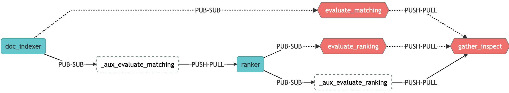

<p align="center">
 
[](https://jina.ai)
[](https://github.com/jina-ai/jina#jina-hello-world-)
[](#license)
[](https://docs.jina.ai)
[](https://jobs.jina.ai)
<a href="https://twitter.com/intent/tweet?text=%F0%9F%91%8DCheck+out+Jina%3A+the+New+Open-Source+Solution+for+Neural+Information+Retrieval+%F0%9F%94%8D%40JinaAI_&url=https%3A%2F%2Fgithub.com%2Fjina-ai%2Fjina&hashtags=JinaSearch&original_referer=http%3A%2F%2Fgithub.com%2F&tw_p=tweetbutton" target="_blank">
  </img>
</a>
[](#)
[](https://hub.docker.com/r/jinaai/jina/tags)

</p>

#Evaluate a Financial Question Answering System in Jina

This example is an extension of [jina-financial-qa-search](https://github.com/yuanbit/jina-financial-qa-search),
which is a production-ready BERT-based Financial Question Answering System built using Jina. In this example,
we add the evaluation pipeline into the QA system by designing a Flow to evaluate the search results with 
Precision and Mean Reciprocal Rank (MRR). We will evaluate the search results before and after reranking with FinBERT-QA. Here is overview of the Evaluation Flow:

**🦉 Please refer to this [tutorial](https://github.com/jina-ai/_homepage/blob/posts-financial-qa-tutorial/_posts/2020-12-14-financial-qa-tutorial.md)
for a step-by-step guide and detailed explanations.**

<p align="center">

</p>

## Set up

### Clone:

```
git clone https://github.com/yuanbit/jina-financial-qa-evaluator-template.git
```

We will use ```jina-financial-qa-evaluator-template/``` as our working directory. 

### Install:

```pip install -r requirements.txt```

### Download data and model:

```bash get_data.sh```


## Community

- [Slack channel](https://join.slack.com/t/jina-ai/shared_invite/zt-dkl7x8p0-rVCv~3Fdc3~Dpwx7T7XG8w) - a communication platform for developers to discuss Jina
- [Community newsletter](mailto:newsletter+subscribe@jina.ai) - subscribe to the latest update, release and event news of Jina
- [LinkedIn](https://www.linkedin.com/company/jinaai/) - get to know Jina AI as a company and find job opportunities
- [](https://twitter.com/JinaAI_) - follow us and interact with us using hashtag `#JinaSearch`  
- [Company](https://jina.ai) - know more about our company, we are fully committed to open-source!

## License

Copyright (c) 2021 Jina's friend. All rights reserved.


